# IBM i Agent Infrastructure

Production-ready agent infrastructure for IBM i system administration and performance monitoring. Built on [Agno](https://agno.link/gh) AgentOS with specialized IBM i agents that use MCP (Model Context Protocol) tools.

## Architecture

```mermaid
graph TB
    UI[Agent UI<br/>Web Interface]

    subgraph "AgentOS Stack"
        Agents[IBM i Agents<br/>Performance · Discovery<br/>Browse · Search]
        MCP[<b>IBM i MCP Server</b><br/>Central Tool Provider]
        DB[(PostgreSQL<br/>Sessions & Memory)]
    end

    LLM[AI Models<br/>watsonx · OpenAI · Anthropic]
    IBM_i[IBM i System<br/>Db2 Database]

    UI -->|User Queries| Agents
    Agents <-->|<b>MCP Protocol</b><br/><b>Tool Calls</b>| MCP
    Agents -.->|Inference| LLM
    Agents -->|Persist| DB
    MCP -->|SQL Queries<br/>System Services| IBM_i

    %% Styling with better contrast
    classDef ui fill:#0288d1,stroke:#01579b,stroke-width:3px,color:#fff
    classDef agents fill:#ff6f00,stroke:#e65100,stroke-width:3px,color:#fff
    classDef mcp fill:#2e7d32,stroke:#1b5e20,stroke-width:4px,color:#fff
    classDef external fill:#7b1fa2,stroke:#4a148c,stroke-width:2px,color:#fff
    classDef database fill:#c2185b,stroke:#880e4f,stroke-width:2px,color:#fff

    class UI ui
    class Agents agents
    class MCP mcp
    class LLM,IBM_i external
    class DB database
```



### Architecture Overview

The IBM i Agent Infrastructure is built around the **MCP Server as the central component**, providing all agents with unified access to IBM i system data and services.

**Key Components:**

- **Agent UI**: Web-based chat interface for interacting with specialized agents
- **IBM i Agents**: Four specialized agents (Performance, Discovery, Browse, Search) that orchestrate IBM i operations
- **MCP Server** ⭐: Central tool provider enabling agents to query IBM i databases and system services via standardized protocol
- **PostgreSQL**: Persistent storage for agent sessions, memory, and conversation history
- **AI Models**: Multi-provider LLM support (watsonx, OpenAI, Anthropic) for agent intelligence
- **IBM i System**: Production IBM i environment with Db2 database

**How It Works:**

1. Users interact with agents through the web UI
2. Agents leverage the **MCP Server** to access IBM i data via tool calls
3. MCP Server executes SQL queries and retrieves system information
4. Agents use AI models for reasoning and natural language understanding
5. All interactions are persisted in PostgreSQL for continuity


## Prerequisites

- [Docker Desktop](https://www.docker.com/products/docker-desktop) installed and running or Podman
- API key from **at least one** AI provider:
  - [watsonx API key](https://cloud.ibm.com/) (IBM Cloud) **OR**
  - [OpenAI API key](https://platform.openai.com/api-keys) **OR**
  - [Anthropic API key](https://console.anthropic.com)

> **Note**: The IBM i MCP server runs automatically as part of the Docker Compose stack - no separate setup required!

## Quick Start

Get the IBM i Agent Infrastructure running in 3 steps:

### 1. Configure API Keys

Navigate to the project directory:

```bash
cd app
```
Create `infra/.env` with your API keys (choose at least one provider):
```bash
# AI Model Provider (Choose at least one)
# Anthropic - Get from console.anthropic.com (default model)
ANTHROPIC_API_KEY=sk-your_anthropic_key

# watsonx (IBM Cloud) - Get from cloud.ibm.com
WATSONX_API_KEY=your_ibm_cloud_api_key
WATSONX_PROJECT_ID=your_project_id

# OpenAI - Get from platform.openai.com/api-keys
OPENAI_API_KEY=sk-your_openai_key
```

> **📖 For detailed configuration options**, including MCP settings, database configuration, and agent customization, see the **[Configuration Guide](infra/README.md)**

### 2. Start the Application

**Using ag CLI** (recommended):
```sh
source .venv/bin/activate
ag infra up
```

**Or using Docker Compose directly**:
```sh
docker compose up -d --build
```

This starts:
- **AgentOS API**: [http://localhost:8000](http://localhost:8000)
- **IBM i MCP Server**: [http://localhost:3010](http://localhost:3010/health) (automatically included)
- **PostgreSQL Database**: `localhost:5432`
- **Agent UI**: [http://localhost:3000](http://localhost:3000) (optional)
- **API Documentation**: [http://localhost:8000/docs](http://localhost:8000/docs)

### 3. Access and Use the Application

Once the application is running, you can interact with the agents in several ways:
1. Open source Agent UI
2. Direct API calls
3. AgentOS Control Plane

#### **Option 1: Agent UI**
Open [http://localhost:3000](http://localhost:3000) in your browser to interact with the agents via a user-friendly interface:

- add AgentOS endpoint `http://localhost:8000`

#### **Option 2: Direct API Calls** (Recommended for Testing)

Open [http://localhost:8000/docs](http://localhost:8000/docs) in your browser to access the Swagger UI where you can:
- Browse all available agents and endpoints
- Test agents directly in the browser
- View request/response schemas
- See example payloads

Use curl or any HTTP client to call the agents:

```bash
# Check IBM i system performance
curl -X 'POST' \
  'http://localhost:8000/agents/ibmi-performance-monitor/runs' \
  -H 'accept: application/json' \
  -H 'Content-Type: multipart/form-data' \
  -F 'message=Check my system status' \
  -F 'stream=false'
```

#### **Option 3: AgentOS UI** (Visual Chat Interface)

1. Open [os.agno.com](https://os.agno.com) in your browser
2. Click "Connect to Local" and enter `http://localhost:8000`
3. Select an agent from the sidebar
4. Start chatting with the agent

#### **Verify Setup**

Check that everything is running correctly:

```bash
# Check service health
curl http://localhost:8000/health

# List available agents
curl http://localhost:8000/agents

# View PostgreSQL database (optional)
docker compose exec postgres psql -U postgres -d agno -c "\dt"
```

### 4. Managing the Application

**Stop the application**:
```sh
ag infra down
# or: docker compose down
```

**Restart the application**:
```sh
ag infra restart
# or: docker compose restart
```

**View logs**:
```sh
docker compose logs -f
```

**Check status**:
```sh
docker compose ps
```

### Troubleshooting

<details>
<summary><strong>❌ Error: "Unable to serialize unknown type: ModelInference"</strong></summary>

**Cause**: This error occurs when the WatsonX model client can't be serialized for MCP communication.

**Solution**: This has been fixed in the latest version of `agents/utils/filtered_mcp_tools.py`. Make sure you're using the latest code:
```sh
git pull
docker compose up -d --build
```
</details>

<details>
<summary><strong>❌ Error: "cannot import name 'ParsedBetaContentBlockStopEvent' from 'anthropic'"</strong></summary>

**Cause**: Incompatible version of the Anthropic SDK.

**Solution**: Update the Anthropic SDK version in `pyproject.toml` to `>=0.80.0` and regenerate requirements:
```sh
./scripts/generate_requirements.sh
docker compose up -d --build
```
</details>

<details>
<summary><strong>🔌 MCP Connection Errors</strong></summary>

**Symptoms**: "Failed to connect to MCP server" or timeout errors

**Solutions**:
1. **Verify MCP server container is running**:
   ```sh
   docker compose ps ibmi-mcp-server
   curl http://localhost:3010/health
   ```

2. **Check MCP server logs**:
   ```sh
   docker compose logs ibmi-mcp-server
   ```

3. **Verify network configuration**:
   - The MCP server runs automatically in Docker Compose on `ibmi-mcp-server:3010`
   - Default `MCP_URL` in `.env` should be: `http://ibmi-mcp-server:3010/mcp`
   - See [Configuration Guide](infra/README.md#mcp-server-configuration) for details

4. **Restart the MCP server**:
   ```sh
   docker compose restart ibmi-mcp-server
   ```
</details>

<details>
<summary><strong>🔑 API Key Issues</strong></summary>

**Symptoms**: "Invalid API key" or authentication errors

**Solutions**:
1. **Verify API keys are set correctly** in `infra/.env`:
   ```sh
   # Check if env file exists and has correct format
   cat infra/.env | grep API_KEY
   ```

2. **Restart after changing .env**:
   ```sh
   docker compose down
   docker compose up -d
   ```

3. **Test API keys directly**:
   - watsonx: Check at [cloud.ibm.com](https://cloud.ibm.com)
   - OpenAI: Check at [platform.openai.com/api-keys](https://platform.openai.com/api-keys)
</details>

<details>
<summary><strong>📊 Database Connection Issues</strong></summary>

**Symptoms**: "Failed to connect to database" errors

**Solutions**:
1. **Check PostgreSQL is running**:
   ```sh
   docker compose ps postgres
   ```

2. **Verify database credentials** match in `infra/.env` and `compose.yml`

3. **Reset database** (warning: deletes all data):
   ```sh
   docker compose down -v
   docker compose up -d
   ```
</details>

<details>
<summary><strong>🐛 Enable Debug Mode</strong></summary>

To get more detailed logs for troubleshooting:

1. **In `infra/.env`**:
   ```bash
   DEBUG=true
   LOG_LEVEL=DEBUG
   ```

2. **In `infra/config.yaml`** (for specific agent):
   ```yaml
   agents:
     ibmi-performance-monitor:
       debug_mode: true
   ```

3. **Restart and view logs**:
   ```sh
   docker compose restart
   docker compose logs -f agent-api
   ```
</details>

<details>
<summary><strong>📖 View Agent Logs</strong></summary>

```sh
# All services
docker compose logs -f

# Specific service
docker compose logs -f agent-api

# Last 100 lines
docker compose logs --tail=100 agent-api

# Follow with timestamps
docker compose logs -f -t agent-api
```
</details>

---

## IBM i Agents

The infrastructure includes specialized agents for IBM i administration:

### Performance Agent
Monitor and analyze IBM i system performance.

**Capabilities**:
- System status and activity monitoring
- CPU utilization analysis
- Memory pool tracking
- Job performance analysis
- HTTP server metrics


**API Endpoint**: `/agents/ibmi-performance-monitor`

### SysAdmin Agents

Three specialized agents for system administration:

**Discovery Agent** (`/agents/ibmi-sysadmin-discovery`):
- High-level system overviews
- Service category summaries
- Component inventories

**Browse Agent** (`/agents/ibmi-sysadmin-browse`):
- Detailed service exploration
- Schema-based browsing
- Object type filtering

**Search Agent** (`/agents/ibmi-sysadmin-search`):
- Service name searches
- Example code lookup
- Documentation searches

## Workflows (Beta)

Pre-built workflows for common IBM i tasks (see [workflows/](workflows/)):

- **Simple Performance Check**: Quick system health assessment
- **Performance Investigation**: Deep dive into performance issues
- **Capacity Planning**: Resource utilization forecasting
- **Database Tuning**: Db2 performance optimization
- **System Health Audit**: Comprehensive system analysis


## Development Setup

To setup your local virtual environment:

### Install `uv`

We use `uv` for python environment and package management. Install it by following the the [`uv` documentation](https://docs.astral.sh/uv/#getting-started) or use the command below for unix-like systems:

```sh
curl -LsSf https://astral.sh/uv/install.sh | sh
```

### Create Virtual Environment & Install Dependencies

Run the `dev_setup.sh` script. This will create a virtual environment and install project dependencies:

```sh
./scripts/dev_setup.sh
```

### Activate Virtual Environment

Activate the created virtual environment:

```sh
source .venv/bin/activate
```

(On Windows, the command might differ, e.g., `.venv\Scripts\activate`)

## Managing Python Dependencies

If you need to add or update python dependencies:

### Modify pyproject.toml

Add or update your desired Python package dependencies in the `[dependencies]` section of the `pyproject.toml` file.

### Generate requirements.txt

The `requirements.txt` file is used to build the application image. After modifying `pyproject.toml`, regenerate `requirements.txt` using:

```sh
./scripts/generate_requirements.sh
```

To upgrade all existing dependencies to their latest compatible versions, run:

```sh
./scripts/generate_requirements.sh upgrade
```

### Rebuild Docker Images

Rebuild your Docker images to include the updated dependencies:

```sh
docker compose up -d --build
```

## Running Tests

This project comes with a set of integration tests that you can use to ensure the application is working as expected.

First, start the application:

```sh
docker compose up -d
```

Then, run the tests:

```sh
pytest tests/
```

Then close the application again:

```sh
docker compose down
```

## Community & Support

Need help, have a question, or want to connect with the community?

- 📚 **[Read the Agno Docs](https://docs.agno.com)** for more in-depth information.
- 💬 **Chat with us on [Discord](https://agno.link/discord)** for live discussions.
- ❓ **Ask a question on [Discourse](https://agno.link/community)** for community support.
- 🐛 **[Report an Issue](https://github.com/agno-agi/agent-api/issues)** on GitHub if you find a bug or have a feature request.

## Running in Production

This repository includes a `Dockerfile` for building a production-ready container image of the application.

The general process to run in production is:

1. Update the `scripts/build_image.sh` file and set your IMAGE_NAME and IMAGE_TAG variables.
2. Build and push the image to your container registry:

```sh
./scripts/build_image.sh
```

3. Run in your cloud provider of choice.

### Detailed Steps

1. **Configure for Production**

- Ensure your production environment variables (e.g., `OPENAI_API_KEY`, database connection strings) are securely managed. Most cloud providers offer a way to set these as environment variables for your deployed service.
- Review the agent configurations in the `/agents` directory and ensure they are set up for your production needs (e.g., correct model versions, any production-specific settings).

2. **Build Your Production Docker Image**

- Update the `scripts/build_image.sh` script to set your desired `IMAGE_NAME` and `IMAGE_TAG` (e.g., `your-repo/agent-api:v1.0.0`).
- Run the script to build and push the image:

  ```sh
  ./scripts/build_image.sh
  ```

3. **Deploy to a Cloud Service**
   With your image in a registry, you can deploy it to various cloud services that support containerized applications. Some common options include:

- **Serverless Container Platforms**:

  - **Google Cloud Run**: A fully managed platform that automatically scales your stateless containers. Ideal for HTTP-driven applications.
  - **AWS App Runner**: Similar to Cloud Run, AWS App Runner makes it easy to deploy containerized web applications and APIs at scale.
  - **Azure Container Apps**: Build and deploy modern apps and microservices using serverless containers.

- **Container Orchestration Services**:

  - **Amazon Elastic Container Service (ECS)**: A highly scalable, high-performance container orchestration service that supports Docker containers. Often used with AWS Fargate for serverless compute or EC2 instances for more control.
  - **Google Kubernetes Engine (GKE)**: A managed Kubernetes service for deploying, managing, and scaling containerized applications using Google infrastructure.
  - **Azure Kubernetes Service (AKS)**: A managed Kubernetes service for deploying and managing containerized applications in Azure.

- **Platform as a Service (PaaS) with Docker Support**

  - **Railway.app**: Offers a simple way to deploy applications from a Dockerfile. It handles infrastructure, scaling, and networking.
  - **Render**: Another platform that simplifies deploying Docker containers, databases, and static sites.
  - **Heroku**: While traditionally known for buildpacks, Heroku also supports deploying Docker containers.

- **Specialized Platforms**:
  - **Modal**: A platform designed for running Python code (including web servers like FastAPI) in the cloud, often with a focus on batch jobs, scheduled functions, and model inference, but can also serve web endpoints.

The specific deployment steps will vary depending on the chosen provider. Generally, you'll point the service to your container image in the registry and configure aspects like port mapping (the application runs on port 8000 by default inside the container), environment variables, scaling parameters, and any necessary database connections.

4. **Database Configuration**

- The default `docker-compose.yml` sets up a PostgreSQL database for local development. In production, you will typically use a managed database service provided by your cloud provider (e.g., AWS RDS, Google Cloud SQL, Azure Database for PostgreSQL) for better reliability, scalability, and manageability.
- Ensure your deployed application is configured with the correct database connection URL for your production database instance. This is usually set via an environment variables.

## Resources

- **[Agno Documentation](https://docs.agno.com)** - AgentOS framework
- **[IBM i MCP Server](https://github.com/IBM/ibmi-mcp-server)** - MCP server documentation
- **[Configuration Guide](infra/README.md)** - Environment setup
