# AgentOS OpenShift Template

Deploy a full-stack AI agent platform on Red Hat OpenShift for IBM Power, with IBM i MCP server. 


[What is AgentOS?](https://docs.agno.com/agent-os/introduction) · [Agno Docs](https://docs.agno.com) · [IBM i MCP Server](https://github.com/IBM/ibmi-mcp-server)

## Architecture

```mermaid
graph TB
    UI[Agent UI<br/>Web Interface]

    subgraph "AgentOS Stack"
        Agents[IBM i Agents<br/>Performance · Discovery<br/>Browse · Search]
        MCP[<b>IBM i MCP Server</b><br/>Central Tool Provider]
        DB[(PostgreSQL<br/>Sessions & Memory)]
    end

    LLM[AI Models<br/>watsonx · OpenAI · Anthropic]
    IBM_i[IBM i System<br/>Db2 Database]

    UI -->|User Queries| Agents
    Agents <-->|<b>MCP Protocol</b><br/><b>Tool Calls</b>| MCP
    Agents -.->|Inference| LLM
    Agents -->|Persist| DB
    MCP -->|SQL Queries<br/>System Services| IBM_i

    %% Styling with better contrast
    classDef ui fill:#0288d1,stroke:#01579b,stroke-width:3px,color:#fff
    classDef agents fill:#ff6f00,stroke:#e65100,stroke-width:3px,color:#fff
    classDef mcp fill:#2e7d32,stroke:#1b5e20,stroke-width:4px,color:#fff
    classDef external fill:#7b1fa2,stroke:#4a148c,stroke-width:2px,color:#fff
    classDef database fill:#c2185b,stroke:#880e4f,stroke-width:2px,color:#fff

    class UI ui
    class Agents agents
    class MCP mcp
    class LLM,IBM_i external
    class DB database
```



## Quick Start

Get the platform running locally in 4 steps.

**Prerequisites**: Docker Desktop installed, API key from at least one provider ([Anthropic](https://console.anthropic.com), [watsonx](https://cloud.ibm.com/), or [OpenAI](https://platform.openai.com/api-keys))

> **Note**: Compatible with Podman; examples show Docker commands.

### 1. Clone and Configure

```bash
git clone <repository-url>
cd agentos-openshift-template/app
cp infra/.env.example infra/.env
```

### 2. Edit Environment Variables

Open `infra/.env` and add your credentials:

```bash
# AI Provider (choose at least one)
ANTHROPIC_API_KEY=sk-your_anthropic_key

# IBM i Connection
DB2_HOST=your-ibmi-hostname
DB2_USER=your-username
DB2_PASSWORD=your-password
DB2_DATABASE=*LOCAL
```

See the [Configuration Guide](infra/README.md) for all options.

### 3. Start the Stack

```bash
docker compose up -d
```

This starts:
- **AgentOS API**: http://localhost:8000
- **IBM i MCP Server**: http://localhost:3010/health
- **PostgreSQL Database**: localhost:5432
- **Agent UI** (optional): http://localhost:3000

### 4. Connect and Test

**Option 1: Agent UI**

1. Open http://localhost:3000
2. Add AgentOS endpoint: `http://localhost:8000`
3. Select an agent and start chatting

**Option 2: API Docs**

1. Open http://localhost:8000/docs
2. Browse agents and test directly in browser

**Option 3: Curl**

```bash
curl -X POST http://localhost:8000/agents/ibmi-performance-monitor/runs \
  -H 'Content-Type: multipart/form-data' \
  -F 'message=Check my system status' \
  -F 'stream=false'
```

**Verify Health:**

```bash
curl http://localhost:8000/health
curl http://localhost:3010/health
```

## What's Included

Four specialized agents for IBM i administration:

- **Performance Monitor** (`/agents/ibmi-performance-monitor`) - System activity, CPU, memory pools, job analysis, HTTP metrics
- **Discovery Agent** (`/agents/ibmi-sysadmin-discovery`) - High-level system overviews and component inventories
- **Browse Agent** (`/agents/ibmi-sysadmin-browse`) - Detailed service exploration with schema browsing
- **Search Agent** (`/agents/ibmi-sysadmin-search`) - Service name searches and documentation lookup

Full API documentation: http://localhost:8000/docs

## Architecture Overview

The platform uses the **IBM i MCP Server** as a central component, providing all agents with unified access to IBM i system data via the Model Context Protocol (MCP). Users interact with specialized agents through the web UI, which orchestrate operations by making tool calls to the MCP server. The MCP server executes SQL queries against IBM i Db2 databases, while agents use AI models for reasoning and natural language understanding. All conversations are persisted in PostgreSQL for session continuity.

Learn more: [Agno Documentation](https://docs.agno.com)

## OpenShift Deployment

Deploy the platform to Red Hat OpenShift using Kustomize and source-to-image builds. The deployment includes the AgentOS API, UI, IBM i MCP Server, and pgvector database.

**Full instructions:** [deployment/README.md](deployment/)

**Quick overview:**

```bash
cd deployment/openshift
# 1. Edit kustomization.yaml with your namespace
# 2. Configure .env files with IBM i connection
# 3. Deploy
kustomize build . | oc apply -f -
```

## Configuration Reference

The platform uses two configuration files:

| File | Purpose | Location |
|------|---------|----------|
| `.env` | **API keys, database credentials, MCP connection** | `infra/.env` |
| `config.yaml` | Agent behavior, model selection, UI settings | `infra/config.yaml` |

**Key Environment Variables:**

| Variable | Required | Description |
|----------|----------|-------------|
| **IBM i Connection** | | |
| `DB2_HOST` | Yes | IBM i hostname or IP |
| `DB2_USER` | Yes | IBM i user profile |
| `DB2_PASSWORD` | Yes | IBM i password |
| `DB2_DATABASE` | No | Database name (default: *LOCAL) |
| **AI Provider** | | |
| `ANTHROPIC_API_KEY` | One required | Anthropic API key |
| `WATSONX_API_KEY` | One required | IBM watsonx API key |
| `OPENAI_API_KEY` | One required | OpenAI API key |
| **MCP Server** | | |
| `MCP_URL` | Auto-configured | MCP endpoint (default: http://ibmi-mcp-server:3010/mcp) |

**Full configuration guide:** [infra/README.md](infra/README.md)

## Managing the Application

<details>
<summary><strong>Common Operations</strong></summary>

**Stop the application:**
```bash
docker compose down
```

**Restart the application:**
```bash
docker compose restart
```

**View logs:**
```bash
docker compose logs -f

# Specific service
docker compose logs -f agent-api
```

**Check status:**
```bash
docker compose ps
```

**Database access:**
```bash
docker compose exec postgres psql -U postgres -d agno -c "\dt"
```

</details>

## Resources

- **[Agno Documentation](https://docs.agno.com)** - AgentOS framework guide
- **[IBM i MCP Server](https://github.com/IBM/ibmi-mcp-server)** - MCP server source and documentation
- **[Configuration Guide](infra/README.md)** - Complete environment variable reference
- **[OpenShift Deployment](deployment/)** - Production deployment guide

## Community & Support

- 📚 **[Agno Docs](https://docs.agno.com)** for in-depth information
- 💬 **[Discord](https://agno.link/discord)** for live discussions
- ❓ **[Discourse](https://agno.link/community)** for community support
- 🐛 **[GitHub Issues](https://github.com/agno-agi/agent-api/issues)** for bugs and feature requests

## Development

<details>
<summary><strong>Local Development Setup</strong></summary>

### Install `uv`

We use `uv` for Python environment and package management:

```bash
curl -LsSf https://astral.sh/uv/install.sh | sh
```

See the [`uv` documentation](https://docs.astral.sh/uv/#getting-started) for more details.

### Create Virtual Environment

Run the setup script:

```bash
./scripts/dev_setup.sh
source .venv/bin/activate
```

### Managing Dependencies

**Add or update dependencies:**

1. Modify the `[dependencies]` section in `pyproject.toml`
2. Regenerate `requirements.txt`:
   ```bash
   ./scripts/generate_requirements.sh
   ```
3. Rebuild Docker images:
   ```bash
   docker compose up -d --build
   ```

**Upgrade all dependencies:**
```bash
./scripts/generate_requirements.sh upgrade
```

</details>
